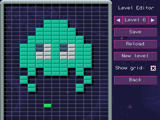

# Wallbreaker

Wallbreaker is a clone of the famous Arkanoid/Breakout games, written in C++ with SFML.

The game features various power-ups, 20 levels, and a level editor.

Download link for the Windows release: [wallbreaker_0.3_windows.zip](https://github.com/abodelot/wallbreaker/releases/download/v0.3/wallbreaker_0.3-windows.zip)

See *How to build from source* section for Linux support.

## How to play?

- Move the paddle with the mouse to catch the ball, or use the left/right arrow keys.
- Click or press `Space` to release balls glued to sticky paddle.
- Click or press `Space` to shoot lasers with laser paddle.
- Press `F2` to take a screenshot (saved to app config directory).

## How to use the editor?

- Mouse wheel up/down: change current brick type
- Left click: add brick
- Right click: remove brick

## Where is the configuration file?

The configuration is saved in the app config directory:

- Linux: `$HOME/.config/wallbreaker/settings.ini`
- MacOS: `$HOME/Library/Application Support/wallbreaker/settings.ini`
- Windows: `$APPDATA\wallbreaker\settings.ini`

This directory also contains screenshots.

## How to build from source?

1. Install SFML (www.sfml-dev.org). For Debian/Ubuntu, install `libsfml-dev` package.
2. Run the make command: `make`
3. Run game: `./wallbreaker`

If you want to use another build system or an IDE:
- add the `src` directory to the list of directories to be searched for header files.
- c++17 is required

## About development

- Author: Alexandre Bodelot <alexandre.bodelot@gmail.com>
- Website: https://github.com/abodelot/wallbreaker

Contributions are welcome!

Credits:

- Sounds by Cabeeno Rossley: www.freesound.org/people/Cabeeno%20Rossley/
- Background music by Joshua Hardin
